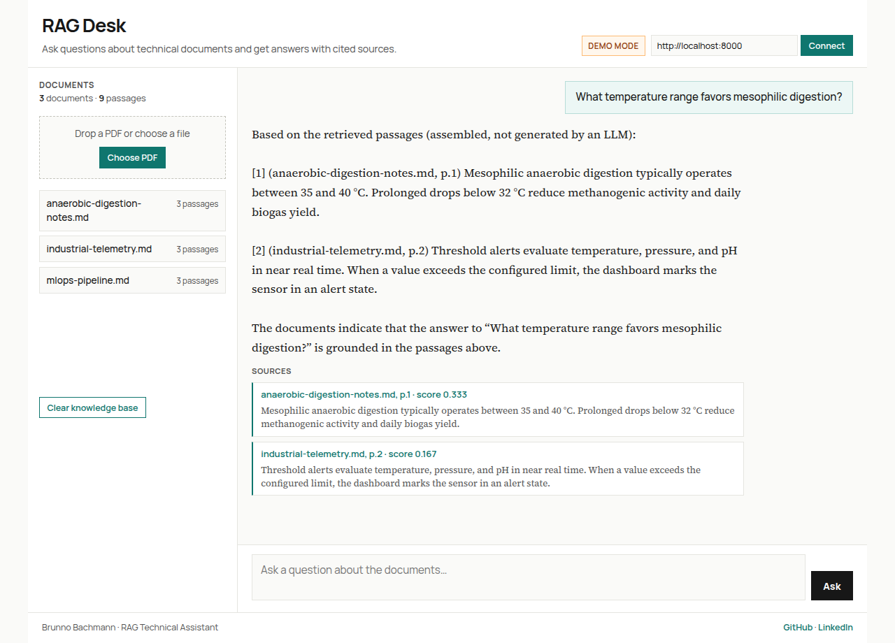

# RAG Technical Assistant

[](https://github.com/Brunnobach/rag-technical-assistant/actions/workflows/ci.yml)

**Problem.** Process knowledge sits in PDFs — plant manuals, SOPs, lab notes. Finding a defensible answer still means opening files and scanning pages.

**What was built.** A self-contained retrieval pipeline: upload a PDF, chunk and embed it, search with dense vectors, then return an answer **assembled from the retrieved passages** with document and page citations. No cloud LLM key is required. An optional local model can rewrite the answer; **by default the API does not generate free-form text** — it templates the retrieved chunks into a cited response.

**Result.** A FastAPI service you can run locally or with Docker, plus a browser desk UI. Offline, the UI answers from an embedded biogas / industrial-telemetry corpus. With the API on `localhost:8000`, you upload real PDFs and call `/query`.

**Live desk:** [https://brunnobach.github.io/rag-technical-assistant/](https://brunnobach.github.io/rag-technical-assistant/)



---

## Features

- PDF upload, text extraction, overlapping chunking, and metadata (document, chunk, page)
- Dense embeddings with `sentence-transformers` (`all-MiniLM-L6-v2`)
- ChromaDB vector store (in-process for tests; Docker service for local runs)
- `/query` returns the templated answer plus ranked sources
- Optional local LLM (`USE_LOCAL_LLM`) — off by default
- Static desk UI: demo mode without a backend, live mode against the API
- pytest coverage for upload, query, citations, health, and reset
- Docker Compose for the API + ChromaDB

---

## Architecture

```
PDF upload → extract text → chunk → embed → ChromaDB
                                              ↓
FastAPI /query → vector search → retrieved passages → template answer + citations
```

Without a local LLM the generator concatenates the top chunks into a deterministic answer. Retrieval quality is the product; generation is an optional extra.

---

## Quick start

### Docker Compose (recommended)

```bash
git clone https://github.com/Brunnobach/rag-technical-assistant.git
cd rag-technical-assistant
docker compose up --build
```

API: `http://localhost:8000` · ChromaDB: `http://localhost:8001` · desk UI: open `index.html` or the [live Pages demo](https://brunnobach.github.io/rag-technical-assistant/) and connect to `http://localhost:8000`.

### Local Python

```bash
python3 -m venv .venv
source .venv/bin/activate
pip install -r requirements.txt
uvicorn rag_technical_assistant.api:app --app-dir src --reload
```

The API uses an in-process Chroma client when `CHROMA_HOST` is `localhost` (the default). Point `CHROMA_HOST` at the Compose service if you want the Dockerized database.

---

## API usage

Health:

```bash
curl http://localhost:8000/health
```

Upload a PDF (a short original anaerobic-digestion note lives at `docs/samples/anaerobic-digestion-notes.pdf`):

```bash
curl -X POST -F "file=@docs/samples/anaerobic-digestion-notes.pdf" http://localhost:8000/upload
```

Ask a question:

```bash
curl -X POST http://localhost:8000/query \
  -H "Content-Type: application/json" \
  -d '{"question": "What temperature range favors mesophilic digestion?", "top_k": 4}'
```

The default (no LLM) response looks like the example in [`docs/examples/cited-answer.md`](docs/examples/cited-answer.md): an assembled block of retrieved passages, each tagged with document name and chunk index, plus a `sources` array.

Reset the store:

```bash
curl -X POST http://localhost:8000/reset
```

---

## Stack

| Layer | Choice |
|-------|--------|
| API | Python 3.11, FastAPI, Uvicorn |
| Embeddings | sentence-transformers (`all-MiniLM-L6-v2`) |
| Vector store | ChromaDB |
| PDF text | pypdf |
| Optional generation | LangChain + local Hugging Face / GGUF model |
| UI | Static HTML/JS (GitHub Pages) |
| Tests | pytest, httpx, fpdf2 |
| Packaging | Docker, Docker Compose |
| CI | GitHub Actions (`ci.yml`: lint, pytest, image build) |

GitHub Pages is published from `main` (site root) by GitHub’s branch-based Pages build. That is the live desk. CI does not call `actions/deploy-pages` — that action needs Pages source set to **GitHub Actions** and a `github-pages` environment, which does not match this repo’s working branch publish.

---

## Configuration

All optional; defaults shown.

| Variable | Default | Description |
|----------|---------|-------------|
| `CHROMA_HOST` | `localhost` | ChromaDB hostname (`localhost` → in-process client) |
| `CHROMA_PORT` | `8001` | ChromaDB port |
| `EMBEDDING_MODEL` | `sentence-transformers/all-MiniLM-L6-v2` | Embedding model |
| `CHUNK_SIZE` | `500` | Words per chunk |
| `CHUNK_OVERLAP` | `100` | Overlap in words |
| `TOP_K` | `4` | Chunks retrieved per query |
| `USE_LOCAL_LLM` | `false` | If `true`, rewrite the answer with a local model |
| `MODEL_PATH` | unset | Optional GGUF path when `USE_LOCAL_LLM=true` |
| `DATA_DIR` | `./data` | Documents and Chroma persistence |

---

## Tests

```bash
pip install -r requirements.txt
pytest
```

Tests use FastAPI `TestClient` and an in-memory Chroma client. Docker is not required for pytest.

---

## Project layout

```
rag-technical-assistant/
├── src/rag_technical_assistant/
│   ├── api.py              # FastAPI app
│   ├── ingestion.py        # PDF extraction and chunking
│   ├── retrieval.py        # ChromaDB + embeddings
│   └── generation.py       # Template answer (optional local LLM)
├── tests/
├── docs/
│   ├── desk-ui-cited-answer.png
│   ├── examples/cited-answer.md
│   └── samples/            # Original sample note (markdown + PDF)
├── docker-compose.yml
├── Dockerfile
├── index.html              # Desk UI (GitHub Pages)
└── .github/workflows/ci.yml
```

---

## License

MIT. See [LICENSE](LICENSE).

Built by [Brunno Bachmann](https://www.linkedin.com/in/brunno-bachmann-865429173) — bioprocess engineering and Python for document retrieval on plant and lab PDFs.
